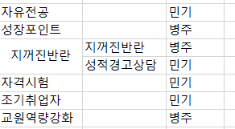

# 2025-05-13

 

- 제주대 통합정보시스템
    - 성장포인트
        - 포탈 화면 작성
        - 통합 화면 수정
    - 교원역량강화
        - 예상 필요 화면
            - 신청 및 내역 확인
            - 참여확인증 출력
            - 만족도조사
        - 질문 작성하기
            - 프로그램에 따른 신청 제한이 있나? (대학, 학과, 직급, 원격, 총인원 등의 제한이 프로그램마다 다른가?)
            - 온라인 특강 시 플랫폼? - 줌? 자체?
            - 붙임 2. 의 강의개선 교육활동 컬럼의 1. 연구모임, 강의개선 컨설팅 과 2. 특강 및 워크숍, 연수 참여 의 차이점
                - 1\. - 특정 기간 내 여러번 만남?
                - 2\. - 1회성?
            - 직번이 입력되지 않은 열이 있어서, 직번을 반드시 입력받지 않아도 되는가?

 

    - 담당
        - 

 

- 성장포인트 화면캡처
