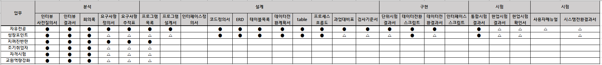

# 2025-08-11

 

- 제주대 통합정보시스템
    - 포탈 서류제출 시 동의 문구
    - 예정 : 포탈 대시보드에 있는 막대그래프2개 포틀릿 추가
        - 쿼리에 연도 박혀 있음. task 연도로 수정할 것
    - [[오류 기록]]

 

    - 해야할 것
        - 성장포인트
            - 프로그램 설계서, 과업대비표, 검사기준서, 단위시험결과서 갱신

 

    - 사용자 매뉴얼
        - 포탈 - 성장포인트 안내 페이지를 제외하고 작성완료
        - 통합 - 어떻게 했는지 물어볼 것 (통합에서 뭐 어떻게 했다고 하는데)

 

    - 프로시저 수정함
