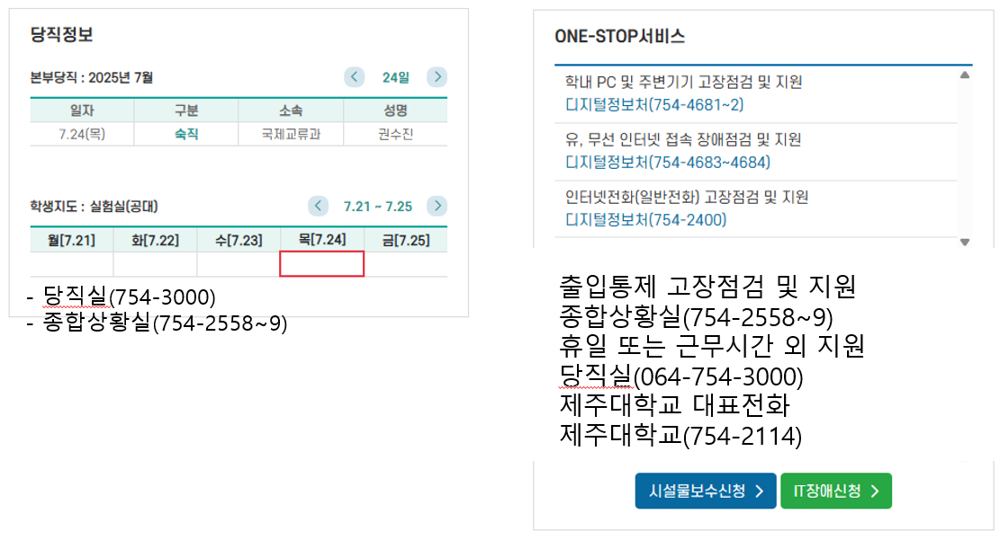

## 07/28

<br>

- 제주대 통합정보시스템
    - ITSM
        - 아이폰 어플에서 비밀번호 찾기 시 팝업차단되는 문제 수정

<br>

<br>

    - 포탈 모바일 수정사항
        - 포틀릿
            - ~~원스탑 서비스 - 당직실 전화번호 추가~~
            - ~~당직정보 - 밑 공간에 당직실 전화번호 추가~~
                - 
            - 캠퍼스맵 - 등록하기 (링크만) , 학생.직원 대상, 교내활동 - 캠퍼스 안내 - 캠퍼스 맵
                - 추후에 퍼블리싱(아이콘?) 추가
            - 다국어 - 다음주 수요일 진행 예정, 관리자페이지의 언어관리와 관련 있음
            - JNU 클래스 링크 - 리다이렉트 후에 뒤로가기하면  검은창이 뜸
            - ~~포틀릿 간격 수정~~
                - 

<br>

    - 예정 : 성장포인트 통합테스트 시나리오 따라가기
        - 통합, 포탈 데이터 쌓아두기section.main div.links p

<br>

<br>

<br>

    - 등록/장학>등록>등록금고지서출력

```java
// 추가된 출력물 은 아래와 같습니다. 출력조건과 파라미터는 기존 등록금 납부확인서와 동일합니다.  (신규출력물 : ADR2090315_R06 )
function Form_ext5Click(obj, e) {
	
	let p = PatisJ.getParam(); // {SCYR: '2024', SCTM: '20', STUNO: 'XXX', STUNM: 'XXX'}
	
	if( !p["STUNM"] ) {
		alert("학생 조회 후 출력 바랍니다.");
		return;
	}
	                 
	//납부 확인서는 항상출력가능
	if (  pInfo.RFEE_HWAKIN_YN == "N") {
		alert("등록금이 납부되지 않았습니다.");
		return;
	} 
	
	if ( pInfo.REG_TRGT_SE_06_YN == "N") {
		alert("수강신청 후 출력 가능합니다.");
		return;
	}
	
	let printTitle = "등록금 납부 확인서(영문)";
	let filePath = "A/ADR/ADR03";
	let fileName = "ADR2090315_R06";
	
	rdHoChul( printTitle, filePath, fileName );
}

확인 후 반영 부탁드립니다. 감사합니다.

테스트 학번 : AM202416702  , 2025학년도 1학기 등록금 납부확인서
```

<br>

<br>

```java
코딩 시 주의사항(현창 부장님 퍼블 버전을 그대로 덮어씌우면 곤람함)
원래 소스와 퍼블 버전의 차이점 하나하나를 비교하면서 작업하는 것이 그나마 정신건강에 이로움
 
 
현창 형 퍼블 : https://github.com/emrdl7/jnu
이것을 인텔리J에 클론하고, show history를 통해서 무엇이 바뀌었는지 비교하면서 작업해야 함
 
 
주의사항
1. svn 버전과 서버 배포 버전이 다름
  예) portal > layout.css
     mobile > layout.css
2. 현창 부장님 버전은 파일 들의 배포 경로가 서버의 배포 경로와 다름
  서버 : /pub/어쩌고저쩌고
  현창 : pub/어쩌고저쩌고
        ../images/aaa.svg
3. 포털/모바일 팝업 띄울 때 소스가 다름
  svn : 공통 팝업 모듈을 활용함
  현창 : 브라우저에서 요소 탭의 내용을 활용함

 
현창 부장님 수정사항
1. 모바일 캠퍼스맵 포틀릿의 아이콘 추가함(p_icon_26.svg)
2. 모바일 메인의 포틀릿 정렬 수정함(포틀릿 수가 홀수, 짝수 구분없이 잘 정렬됨)
  - p태그의 display 속성을 grid로 사용
3. 2차인증 팝업창 변경
```

<br>