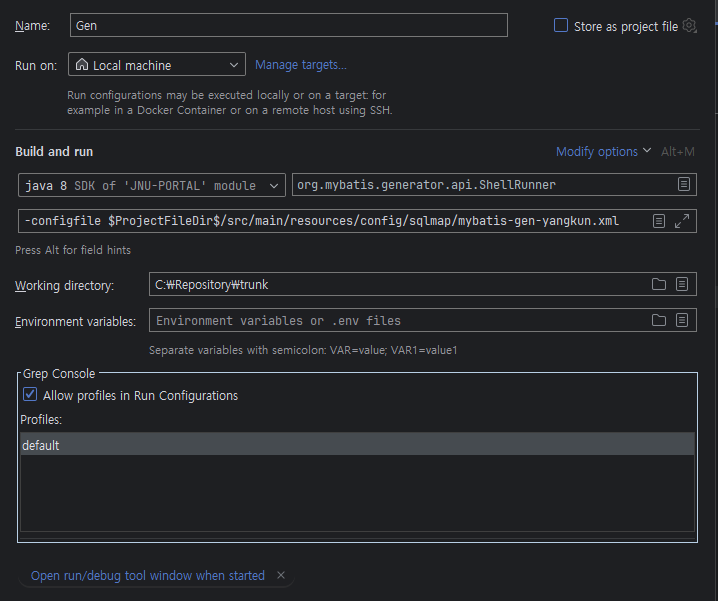

## Mybatis-Generator

<br>

- Run/Debug Configuration → Add New Configuration → Application

<br>

<br>

- mybatis-gen-yangkun.xml

```
<?xml version="1.0" encoding="UTF-8" ?>
<!DOCTYPE generatorConfiguration PUBLIC "-//mybatis.org//DTD MyBatis Generator Configuration 1.0//EN" "http://mybatis.org/dtd/mybatis-generator-config_1_0.dtd" >
<generatorConfiguration>
	<!-- java -cp '/Users/yangkun/works/LOGISTICS/logistics-source/logistics/target/classes:/Users/yangkun/works/LOGISTICS/logistics-source/logistics/target/ROOT/WEB-INF/lib/*' org.mybatis.generator.api.ShellRunner -configfile ~yangkun/works/LOGISTICS/logistics-source/logistics/src/main/resources/generatorConfig.xml -->
	<!-- tibero driver -->
	<classPathEntry location="D:/atomyang_work/portal_real/target/ROOT/WEB-INF/lib/ojdbc8-21.9.0.0.jar"/>

	<!-- <classPathEntry location="D:/java-lib/tibero-5.jar" /> -->

	<context id="tables" targetRuntime="MyBatis3">
		<!-- ARTPQ 기본 플러그인 -->
		<plugin type="com.artpq.dao.mybatis.ArtpqPluginOracle"/>
		<!-- 주석 생략 -->
		<commentGenerator>
			<property name="suppressAllComments" value="true"/>
		</commentGenerator>

		<!-- DB Connection -->
		<!-- <jdbcConnection driverClass="com.mysql.cj.jdbc.Driver" connectionURL="jdbc:mysql://localhost:3306/happyi?useUnicode=true&amp;characterEncoding=UTF-8&amp;useSSL=false&amp;serverTimezone=Asia/Seoul&amp;useReconnect=true" userId="happyi" password="Happyi2022!"/> -->
		<jdbcConnection driverClass="oracle.jdbc.OracleDriver" connectionURL="jdbc:oracle:thin:@203.253.223.40:1521/jnudev" userId="portal" password="!!portaldbpw9@"/>

		<javaTypeResolver>
			<property name="forceBigDecimals" value="false"/>
		</javaTypeResolver>

		<!-- Java Model (Value Object) 과 SQL 맵만 생성  -->
		<javaModelGenerator targetPackage="kr.ac.jejunu.portal.patis.bgp.autIdMng" targetProject="src/main/java">
			<property name="enableSubPackages" value="true"/>
			<property name="trimStrings" value="true"/>
		</javaModelGenerator>

		<table tableName="BGP_AUT_ID_MNG" domainObjectName="AutIdMng">
			<property name="ignoreQualifiersAtRuntime" value="true"/>
			<property name="useColumnIndexes" value="true"/>
			<columnRenamingRule searchString="^AutIdMng_" replaceString=""/>
		</table>
	</context>
</generatorConfiguration>
```

<br>